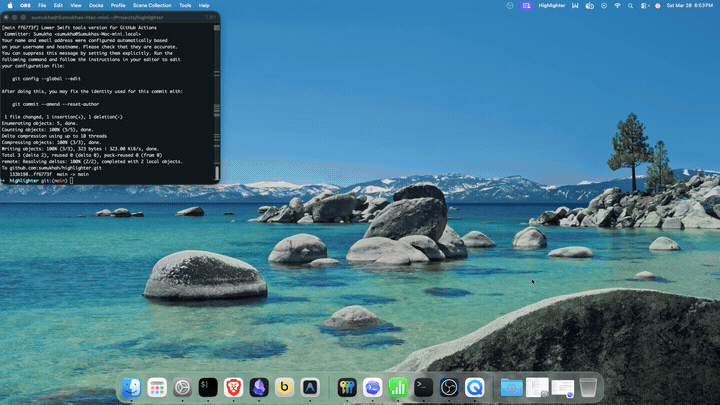

# Highlighter

Highlighter is a lightweight macOS menu bar app for streamers, video creators, demos, and live presentations. Press a hotkey, draw directly on top of your screen with a modern shifting gradient, and let the ink fade away automatically.

## Demo



[Watch or download the full demo video](./demo.mov)

## Download

Users should not need to build Highlighter from source. Once you publish a GitHub Release, they can download the latest macOS build directly from:

[Download Highlighter for macOS](https://github.com/sumukhah/highlighter/releases/latest/download/Highlighter-macOS.zip)

Repository home:

[sumukhah/highlighter](https://github.com/sumukhah/highlighter)

The release archive name already matches the download URL above.

## What It Does

- Runs as a menu bar app instead of a normal dock app
- Uses a global hotkey to enter drawing mode from any app
- Draws ephemeral live ink on the active display
- Shifts color dynamically while you draw for a modern gradient effect
- Fades older stroke segments while you are still drawing
- Clears instantly when you press the hotkey again
- Dismisses the overlay automatically when all visible ink has faded out
- Lets users adjust hotkey, stroke width, fade duration, and launch-at-login

## Default Behavior

- Default hotkey: `Command` + `Shift` + `H`
- Default fade duration: `4` seconds
- First hotkey press starts drawing on the active display
- Second hotkey press clears all visible ink and exits drawing mode

## Installation

### For End Users

1. Download `Highlighter-macOS.zip` from the latest GitHub Release.
2. Unzip it.
3. Drag `Highlighter.app` into `Applications`.
4. Open `Highlighter` from `Applications`, Spotlight, or Launchpad.

### For Maintainers

Create the app bundle:

```bash
./scripts/build-app.sh
```

This outputs:

```bash
dist/Highlighter.app
```

Create the release zip you can upload to GitHub Releases:

```bash
./scripts/build-release-zip.sh
```

This outputs:

```bash
dist/Highlighter-macOS.zip
```

Install locally for testing:

```bash
./scripts/install-app.sh
```

### Signed And Notarized Releases

For public macOS distribution, Highlighter should be Developer ID signed and notarized before release. This repository supports that flow.

Local environment variables used by the release scripts:

- `APPLE_SIGNING_IDENTITY`
  Example: `Developer ID Application: Your Name (TEAMID)`
- `APPLE_ID`
- `APPLE_TEAM_ID`
- `APPLE_APP_SPECIFIC_PASSWORD`

Local notarized release build:

```bash
APPLE_SIGNING_IDENTITY="Developer ID Application: Your Name (TEAMID)" \
APPLE_ID="you@example.com" \
APPLE_TEAM_ID="TEAMID" \
APPLE_APP_SPECIFIC_PASSWORD="app-specific-password" \
./scripts/build-release-zip.sh
```

GitHub Actions secrets expected by the release workflow:

- `BUILD_CERTIFICATE_BASE64`
- `P12_PASSWORD`
- `KEYCHAIN_PASSWORD`
- `APPLE_SIGNING_IDENTITY`
- `APPLE_ID`
- `APPLE_TEAM_ID`
- `APPLE_APP_SPECIFIC_PASSWORD`

`BUILD_CERTIFICATE_BASE64` should be a base64-encoded `.p12` export of your Developer ID Application certificate.

## Development

Run the app locally from source:

```bash
swift run
```

Run tests:

```bash
swift test
```

The app launches as a menu bar extra named `Highlighter`. Open `Settings…` from the menu bar to change the hotkey, stroke width, fade duration, or launch-at-login behavior.

## Project Structure

- `Sources/highlighter` contains the AppKit app, overlay view, hotkey handling, and preferences
- `scripts/build-app.sh` creates a distributable `.app`
- `scripts/build-release-zip.sh` creates the release archive for GitHub Releases
- `scripts/install-app.sh` copies the built app into `Applications`
- `Packaging/Info.plist` defines app bundle metadata

## Open Source Notes

This project is prepared for GitHub Releases. A good release flow is:

1. Push the repository.
2. Create a GitHub Release with a version tag such as `v1.0.0`.
3. GitHub Actions builds `Highlighter-macOS.zip` automatically and attaches it to the release.
4. Keep the direct download link in this README pointing at `releases/latest/download/Highlighter-macOS.zip`.

That gives users a stable, direct download URL without asking them to build the app themselves.

## License

MIT
